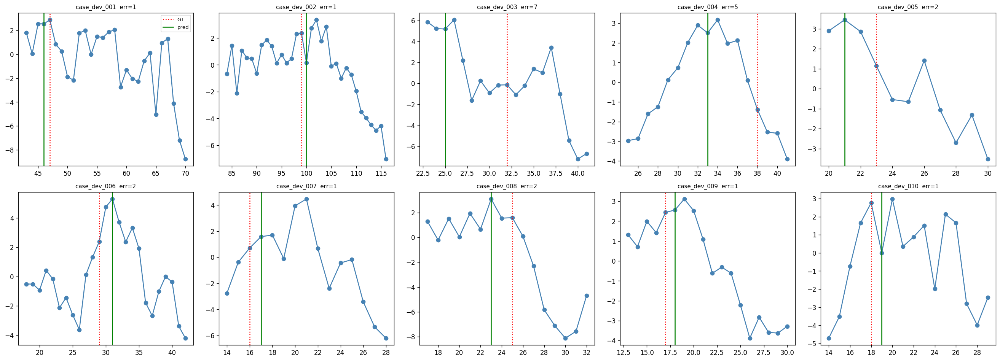
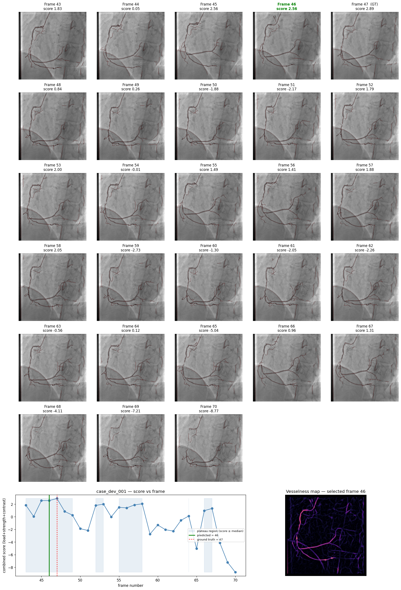
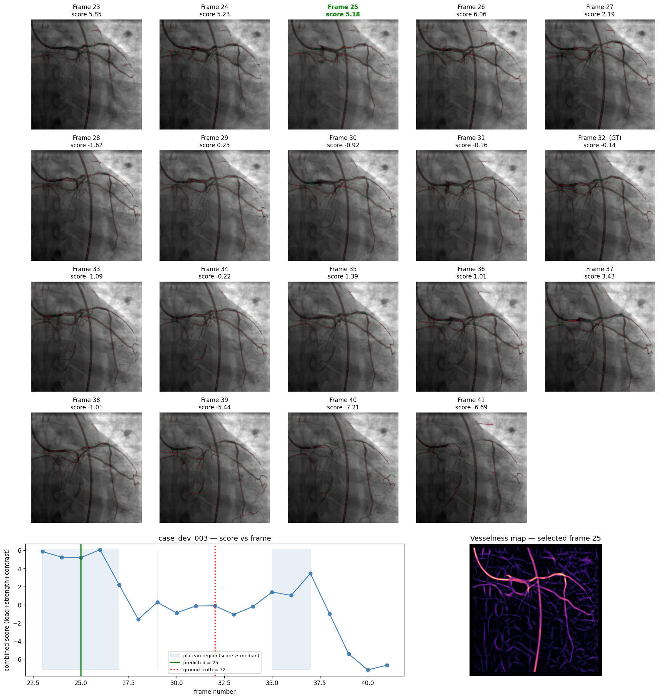

# Best-Frame Selection from Coronary Angiography

Classical computer-vision pipeline that takes a window of ~8–11 angiographic
frames and selects the single frame that best represents the coronary vessel
tree, using only hand-engineered image features (no learned models).

```python
best_frame, scores = select_best_frame(window)   # window = list of image paths or grayscale arrays
```

## 1. Problem Understanding

This is a **frame-ranking problem, not a segmentation problem**. An upstream
system has already found the temporal window where the coronary tree is
visible; the job here is only to compare the frames *within* that window and
say which one is the most useful single representative for downstream
analysis (e.g. QCA, stenosis measurement).

That framing matters for the design: the pipeline never needs a pixel-perfect
vessel mask. It needs measurements that are *comparable across frames of the
same window* — so every feature below is computed relative to the other
frames in the same window, not against a fixed absolute scale.

## 2. Approach

The pipeline has four stages:

Frames --> Preprocessing --> Vesselness --> Per-frame features --> Score --> Best frame
(illumination (Sato ridge (load, strength, (robust z-score,
normalization, filter) contrast) plateau-center
denoise, ROI) selection)


Two ideas drive most of the design decisions:

- **A frame is good when its vessel tree is well-opacified, strong, and
  high-contrast against the background — not when the image is sharp or
  edge-dense in general.** A sharp catheter tip or spine edge should not win.
  So every feature is measured only inside or immediately around the vessel
  region, not over the whole image.
- **A frame that is good because its whole neighborhood is good is more
  trustworthy than a frame that is good because it is a single spike.** A
  one-frame spike can come from noise, a segmentation glitch, or a transient
  contrast reflux flash. This is why the final selection step picks the
  *center of a sustained good stretch* rather than the single highest-scoring
  frame (Section 6).

## 3. Preprocessing

For each frame:

1. **Resize** to a common long-side of 512 px, so absolute pixel-based
   thresholds behave consistently across windows from different acquisitions.
2. **Valid-region mask**: a blurred version of the frame is thresholded to
   drop black collimator borders, which otherwise create false ridge
   responses at the frame edge.
3. **Illumination flattening**: a large-sigma Gaussian blur of the image
   estimates the local background; the frame is expressed as a *relative
   darkness map* `D = (background − image) / background`. This removes
   slow, non-vessel brightness gradients (uneven X-ray field, anatomy shadow)
   and turns contrast-filled vessels into a consistently positive signal,
   regardless of the absolute exposure of that frame.
4. A light Gaussian blur (`pre_sigma`) is applied to `D` before vesselness,
   to suppress pixel-level noise without blurring vessel structure.

## 4. Vesselness

Vessel-likeness is computed with the **Sato filter**
(`skimage.filters.sato`), a Hessian/eigenvalue-based ridge detector run at
multiple scales (`sigmas = 1.5, 2.5, 3.5`) to catch both thin distal branches
and thicker proximal vessels. It responds to elongated ridge structures and
is naturally low on blob-like or scattered noise, which is why it was chosen
over a plain gradient/edge magnitude (edges fire on any strong boundary,
vessel or not).

**Per-frame vessel mask**: hysteresis thresholding (`apply_hysteresis_threshold`)
on the vesselness map, using percentiles pooled **over the whole window**
(one shared low/high threshold, not one per frame). Using a shared threshold
is deliberate — thresholding each frame independently would force every
frame to show "the same amount" of vessel by construction, hiding exactly
the differences we are trying to measure. Small components are removed, the
result is skeletonized, and short skeleton fragments are dropped as noise.

## 5. Features and Mathematical Formulation

Three features are used in the final scoring function (see Section 9 for why
the feature set was pruned to exactly these three):

| Feature | Definition | What it measures |
|---|---|---|
| `load` | `Σ max(V(x) − lo, 0)` over vessel-mask pixels, where `V` is the vesselness map and `lo` is the window's low hysteresis threshold | Total, soft amount of vessel-tree visible — more robust than a hard pixel count because it weights confident vessel pixels more than borderline ones |
| `strength` | mean vesselness value along the frame's own skeleton | How strong/confident the vessel signal is, independent of how much of the tree is visible |
| `contrast` | mean(`D`) on the skeleton core minus mean(`D`) on a ring just outside the vessel mask | Vessel-to-local-background contrast — how opacified the vessel looks against its immediate surroundings, which is scale-invariant to overall image brightness |

Score:

score(F) = z(load(F)) + z(strength(F)) + z(contrast(F))


Equal weights, no fitted coefficients. This is intentional — see Section 9.

## 6. Feature Normalization

Because `load`, `strength`, and `contrast` live on completely different
numeric scales, each is converted to a **robust z-score within its own
window** before combining:

z(x) = clip((x − median(x)) / (1.4826 × MAD(x)), −3, 3)


Median/MAD (median absolute deviation) is used instead of mean/std because a
single frame with an extreme value (e.g. a segmentation failure or a bright
artifact) would otherwise distort the whole window's scale. Clipping to
±3 caps the influence of any single outlier frame on the sum. Normalizing
**per window** (not against a fixed global range) is what lets the same
formula generalize to windows of different sizes, patients, and acquisition
settings — a hard global threshold on `load` or `contrast` would not
transfer between an under-exposed and an over-exposed run.

## 7. How the Final Frame Is Selected

Instead of taking the single frame with the maximum combined score
(`argmax`), the pipeline picks the **temporal center of the longest run of
consecutive frames whose score is at or above the window's median score**
(`plateau_center`):

1. Threshold the score curve at 0 (the median, since z-scores are centered).
2. Find the longest contiguous run of frames above that threshold.
3. Within that run, take a softmax-weighted centroid of frame position
   (weighted by score), rounded to the nearest integer frame.

**Why not argmax:** on the 10 labelled development cases, a plain argmax of
this scoring function gave MAE = 2.8 frames and 60% of cases within ±2 of the
label. Switching only the selection rule to `plateau_center` (same
score, same weights, nothing tuned) improved this to **MAE = 2.3, 80% within
±2**, because it is not thrown off by a single-frame spike and instead
rewards a frame that sits in the middle of a genuinely good stretch — which
also tends to be more representative for downstream analysis than a
transient peak.

## 8. Computational Complexity

Per frame: O(H·W) for filtering, Sato vesselness, and skeletonization, where
H·W is the (resized, 512-long-side) image size. Per window of N frames: the
per-frame cost times N, plus one O(N·H·W) pass to pool the shared threshold
and build the persistent vessel tree. On a standard Colab CPU runtime this is
roughly 0.3–0.5 s per frame, so a full 8–11 frame window runs in under 5
seconds. No step is worse than linear in the number of frames, so runtime
scales gracefully for windows larger than 10–11 frames.

## 9. Development Process / Feature Selection

An earlier version of this pipeline used 11 features (adding vessel
continuity, coverage of a persistent multi-frame vessel tree, and a
frame-to-frame motion penalty). A per-feature ablation and a combination
sweep on the 10 labelled cases showed that **every feature beyond `load`,
`strength`, and `contrast` made results worse**, not better — the extra
features added noise faster than signal on a dataset this small. This is
reported honestly rather than hidden: with only 10 labelled examples,
fitting more free parameters (whether extra features or tuned weights) risks
fitting noise. `select_best_frame` therefore intentionally uses three
features with equal, un-tuned weights.

## 10. Failure Cases

Ground-truth rank of the selected frame (`rankGT` = 0 means the algorithm's
top pick is the ground-truth frame) on the 10 dev cases:

| Case | Predicted | GT | Error (frames) | Rank of GT |
|---|---|---|---|---|
| case_dev_001 | 46 | 47 | 1 | 0 |
| case_dev_002 | 100 | 99 | 1 | 3 |
| case_dev_003 | 25 | 32 | **7** | **9** |
| case_dev_004 | 33 | 38 | **5** | **10** |
| case_dev_005 | 21 | 23 | 2 | 4 |
| case_dev_006 | 31 | 29 | 2 | 4 |
| case_dev_007 | 17 | 16 | 1 | 4 |
| case_dev_008 | 23 | 25 | 2 | 2 |
| case_dev_009 | 18 | 17 | 1 | 3 |
| case_dev_010 | 19 | 18 | 1 | 1 |

**Overall: MAE = 2.3 frames, 8/10 (80%) within ±2 frames of the labelled
best frame.**

**Note on window size.** The assignment brief describes windows of
approximately 8–11 frames. The ten development windows actually range from
11 to 33 frames (mean ≈ 20), per the `num_frames` field in `dev_labels.csv`.
`select_best_frame` does not assume a fixed window length and handles this
range without modification, but the ±2-frame tolerance is a smaller fraction
of a 33-frame window than of an 8-frame one, so the reported 80%-within-±2
figure should be read with that in mind rather than as directly comparable
across cases of very different window sizes.

Three failure cases, with diagnosis and proposed fix:

### 10.1 Cardiac-phase-driven selection the pipeline cannot see (case_dev_003, case_dev_004) 
   In both cases the ground-truth frame's combined score
   ranks 9th–10th out of ~17–19 frames — the middle of the pack, not an
   outlier. Case_dev_003's score curve is clearly bimodal, with two peaks
   roughly 10–12 frames apart (consistent with one cardiac cycle at typical
   fluoroscopy frame rates); the labelled frame sits in the trough between
   them. Case_dev_004's labelled frame has one of the lowest frame-to-frame
   motion values in its window, even though it is past the opacification
   peak. Both point to the annotator trading off some vessel density for a
   stiller, likely end-diastolic frame — information not present in a single
   static frame's contrast/vesselness. **Proposed improvement:** if ECG or
   ventriculogram timing is available, gate candidate frames to a consistent
   cardiac phase before scoring; without ECG, detect periodicity in the
   inter-frame motion signal and prefer local motion minima as a phase proxy.

### 10.2 Frames with strong non-vessel structure (catheter loops, spine, diaphragm edge) 
   Any of these can locally resemble a vessel ridge to a
   Hessian-based filter, especially where they cross or run parallel to a
   real vessel. The illumination-flattening step and the window-shared
   threshold reduce this (static structures don't gain contrast as the
   window progresses, while vessels do), but a persistent straight structure
   present in every frame can still inflate `load` by a roughly constant
   amount across the whole window. **Proposed improvement:** subtract a
   per-window "static structure" map (pixels with near-zero temporal
   variance) from the vesselness map before integrating `load`, similar to
   background subtraction in video analysis.

### 10.3 Windows with only partial vessel-tree filling 
   If contrast has not
   yet reached distal branches by the end of the window, every frame scores
   low and the score curve becomes flat and noisy, so small measurement
   noise can shift the selected frame by several positions even though the
   true differences between frames are small. **Proposed improvement:** flag
   windows where the maximum window `load`/`strength` falls below a general
   floor (learned from typical fully-opacified windows) and route them back
   to the upstream system as "insufficient fill," rather than forcing a
   choice among uniformly poor frames.

## 11. Possible Improvements (with more time)

- ECG-gated or periodicity-based cardiac-phase feature (Section 10.1).
- Static-structure suppression via low temporal-variance masking (Section 10.2).
- A "confidence" output alongside the best frame — e.g. the score gap between
  the top pick and the runner-up, or the width of the winning plateau — so
  downstream systems know when the pick is unambiguous versus borderline.
- Validation on a larger labelled set. Ten cases is enough to catch gross
  errors and compare a few candidate designs, but not enough to safely tune
  more than 2–3 free parameters; a larger dev set would make it possible to
  test whether more features (e.g. the previously-dropped `continuity`,
  `motion`) generalize, rather than concluding from 10 points that they don't.

## 12. Repository Contents

- `source_code.ipynb` — full, runnable pipeline: preprocessing, vesselness,
  feature extraction, scoring, evaluation against `dev_labels.csv`, and
  visualizations.
- `README.md` — this file.
- `figures/` — exported visualizations (see Section 13).

## 13. Usage

```python
best_frame, scores = select_best_frame(window)
```

`window` is a list of ~8–11 items, each either a file path (str) to a
grayscale angiographic frame or an already-loaded grayscale numpy array.
The function does not assume a fixed window length. `best_frame` is the
index into `window` (not a frame number) of the selected frame;
`scores` is the array of per-frame combined scores in the same order as
`window`.

## 14. Visualizations

**Overview — score curve per case (green = predicted, red = ground truth):**



Most cases show the predicted (green) and ground-truth (red dotted) lines
close together, consistent with the 80%-within-±2 result. `case_dev_003`
and `case_dev_004` visibly stand out with flatter, messier curves — these
are the two failure cases discussed in Section 10.

**case_dev_001 — a representative success case (predicted 46, GT 47):**



**case_dev_003 — a failure case (predicted 25, GT 32):**



The score plateau (shaded) sits at frames 23–27, and the ground-truth frame
at 32 sits in the flat trough between two humps — a visual illustration of
the bimodal, cardiac-cycle-linked pattern described in Section 10.1.
